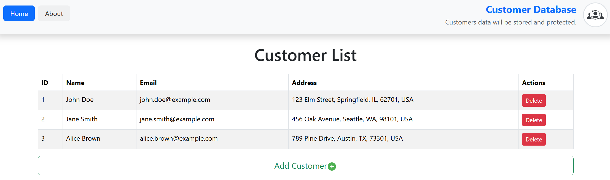
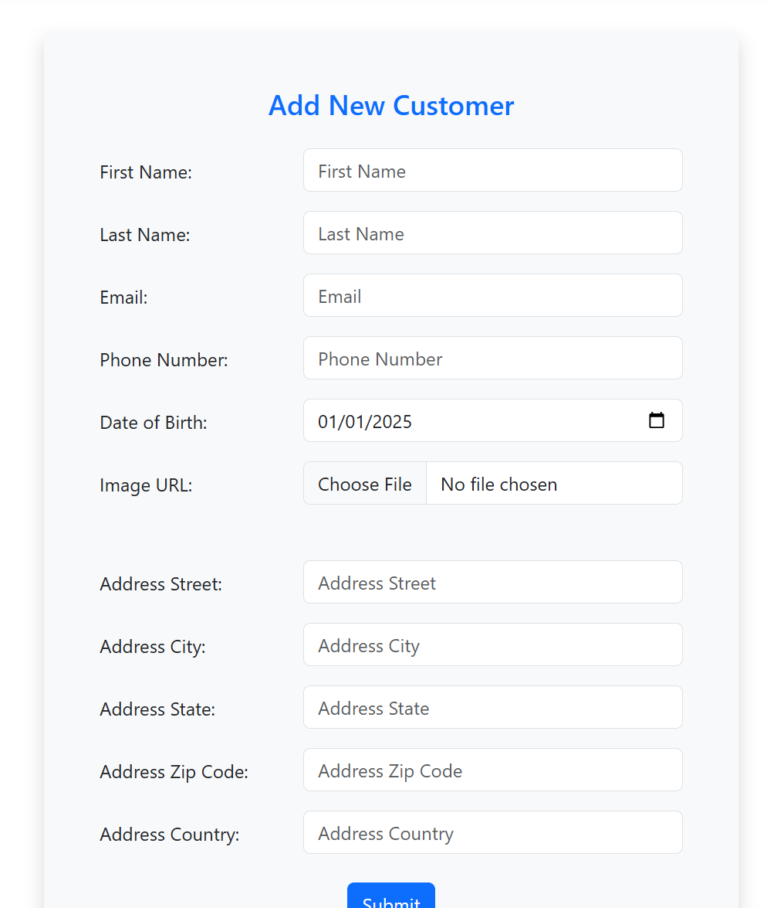
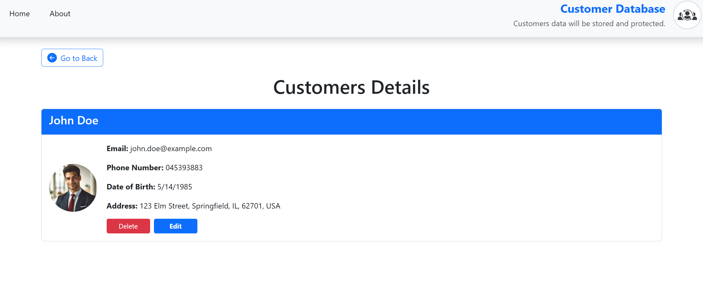
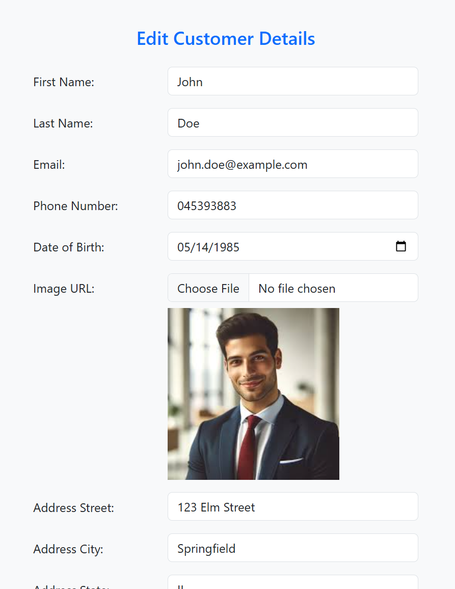

## Customer Database

This project is a customer database management application with a backend built using ASP.NET Core Web API and a modern frontend developed with React, TypeScript, and Redux for state management. It features a clean, layered architecture for scalability and maintainability.

## Features
#### Backend:

- Built using ASP.NET Core Web API with Minimal API for lightweight endpoints.
- Implements Layered Architecture with clear separation of concerns.
- Domain Layer: Encapsulates core business logic and entities.
- Repository Layer: Manages data persistence and retrieval.
- High-performance and scalable API for customer management.

#### Frontend:

- Developed with React and TypeScript for a strong, type-safe user interface.
- Utilizes Redux for efficient state management.
- User-friendly interface to manage customer data.

## Features:

Create, Read, Update, and Delete (CRUD) operations for customers.
Responsive design for seamless usage across devices.

## Technologies Used
##### Backend:
- ASP.NET Core Web API
- Minimal API
- Layered Architecture
- Repository Pattern
- Domain Layer
##### Frontend:
- React
- TypeScript
- Redux
#### Database:
- SQL Server

